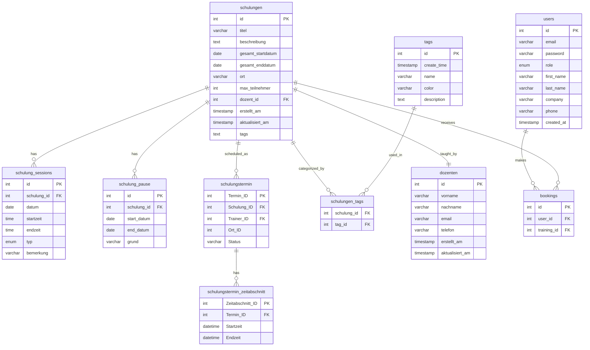

# System Architecture Documentation

## System Architecture Diagram

### Key Components

1. **Frontend Layer**
   - Flutter Mobile Application
   - Services for API communication
   - UI Components (Screens & Widgets)

2. **Backend Layer**
   - Express.js Server
   - RESTful API Endpoints
   - Email Service Integration
   - Connection Pool Management

3. **Database Layer**
   - MySQL Database
   - Core Tables:
     - Users: User management and authentication
     - Trainings: Training course information
     - Bookings: User-Training relationships
     - Tags: Training categorization

### Communication Flow
- Frontend communicates with backend through HTTP requests
- Backend uses connection pooling for efficient database operations
- Email notifications are sent through SMTP server
- All API endpoints are RESTful and handle JSON data

### Security Features
- Password hashing using bcrypt
- CORS protection
- Environment-based configuration
- Connection pool security

## API Flow Diagram

### API Endpoints Overview

1. **Authentication**
   - `POST /api/login`: User authentication
   - Response: JWT token for subsequent requests

2. **Training Management**
   - `GET /api/trainings`: List all trainings
   - `POST /api/trainings`: Create new training
   - `PUT /api/trainings/:id`: Update training
   - `GET /api/trainings/search`: Search with filters
   - `GET /api/trainings/:id/tags`: Get training tags

3. **Booking System**
   - `POST /api/bookings`: Create booking
   - `DELETE /api/bookings`: Cancel booking
   - `GET /api/users/:userId/bookings`: User's bookings

4. **Schedule Management**
   - `GET /api/schulungstermin`: Get schedules
   - `POST /api/schulung_pause`: Add break periods
   - `GET /api/schulungstermin_zeitabschnitt`: Get time slots

### Data Flow Characteristics

1. **Security Measures**
   - JWT-based authentication
   - Request validation
   - SQL injection prevention

2. **Response Formats**
   - JSON responses
   - Standardized error formats
   - Status codes following HTTP conventions

3. **Integration Points**
   - Email notifications for bookings
   - Real-time schedule updates
   - Batch operations for efficiency

4. **Error Handling**
   - Validation errors
   - Business logic errors
   - Database constraints
   - Network issues

## Database Entity Relationship Diagram

### Database Schema Details

1. **Schulungen (Trainings) Table**
   - Core training information including title, description, and location
   - Tracks overall start and end dates
   - Links to lecturer (dozent_id)
   - Includes participant limits and timestamps

2. **Schulung_Sessions Table**
   - Individual session details
   - Stores date and time information
   - Includes session type and remarks

3. **Schulung_Pause (Training Breaks) Table**
   - Manages break periods in trainings
   - Records start and end dates
   - Stores reason for break

4. **Schulungstermin (Training Schedule) Table**
   - Links trainings with trainers and locations
   - Tracks schedule status

5. **Schulungstermin_Zeitabschnitt (Time Slots) Table**
   - Detailed time management
   - Start and end times for specific periods

6. **Tags and Schulungen_Tags Tables**
   - Flexible categorization system
   - Includes color coding and descriptions
   - Many-to-many relationship with trainings

7. **Dozenten (Lecturers) Table**
   - Lecturer contact information
   - Tracks creation and update times

8. **Users Table**
   - User management with roles
   - Personal and contact information
   - Company affiliations

9. **Bookings Table**
   - Manages training registrations
   - Links users with trainings

### Key Relationships
- Each training (Schulung) has one lecturer (Dozent)
- Trainings can have multiple sessions and breaks
- Multiple tags can be assigned to trainings
- Users can book multiple trainings
- Training schedules can have multiple time slots

### Data Integrity Rules
- Timestamps track creation and modifications
- Foreign key relationships ensure data consistency
- Status tracking for training schedules
- Role-based user management

## State Management Flow Diagram

### State Management Architecture

1. **Application States**
   - Initial loading state
   - Authentication state verification
   - Main application state

2. **Provider States**
   
   a. **AuthenticationProvider**
   - Manages user authentication status
   - Handles token refresh cycles
   - Controls login/logout transitions

   b. **TrainingProvider**
   - Manages training data lifecycle
   - Handles CRUD operations
   - Controls filtering and search states

   c. **BookingProvider**
   - Manages booking process states
   - Handles booking confirmations
   - Manages error states

   d. **ThemeProvider**
   - Controls application theme
   - Manages theme transitions

3. **UI States**

   a. **CalendarView**
   - Different calendar view modes
   - View transitions
   - Selection states

   b. **TrainingManagement**
   - Edit/View mode transitions
   - Creation flow states
   - Validation states

   c. **SearchState**
   - Search input handling
   - Results management
   - Empty state handling

4. **Error Handling States**
   - Network error states
   - Validation error states
   - Server error states
   - Recovery flows

### State Update Patterns

1. **Unidirectional Data Flow**
   - State changes flow down
   - Actions flow up
   - Predictable state updates

2. **State Isolation**
   - Providers maintain isolated states
   - Cross-provider communication through services
   - Controlled state access

3. **Error Recovery**
   - Automatic retry mechanisms
   - User-initiated recovery
   - Graceful degradation

4. **State Persistence**
   - Critical state persistence
   - State restoration on app launch
   - Cache management

### Best Practices

1. **State Updates**
   - Atomic state changes
   - Optimistic updates where appropriate
   - Proper error handling

2. **Performance**
   - Minimal rebuilds
   - Efficient state propagation
   - State cleanup on disposal

3. **Testing**
   - Testable state transitions
   - Mocked provider states
   - Error state verification

## Bugs and Revisions

### Known Issues and Status

### Critical Issues

1. **Booking System**
   - **Issue**: Concurrent booking conflicts
   - **Status**: In Progress
   - **Priority**: High
   - **Impact**: User booking experience
   - **Planned Fix**: Implement booking queue system

2. **State Management**
   - **Issue**: Memory leaks in training list
   - **Status**: Under Investigation
   - **Priority**: Medium
   - **Impact**: App performance
   - **Planned Fix**: Optimize provider disposal

3. **Database**
   - **Issue**: Connection timeout during peak loads
   - **Status**: Fixed in v1.1.0
   - **Priority**: High
   - **Impact**: System reliability
   - **Solution**: Implemented connection pooling

### Recent Improvements

1. **Authentication System (v1.2.0)**
   - Implemented JWT token refresh
   - Added secure token storage
   - Enhanced error handling
   - Improved login flow

2. **Training Management (v1.1.0)**
   - Fixed session overlap issues
   - Added break period validation
   - Improved trainer assignment
   - Enhanced calendar sync

3. **Performance Optimizations (v1.2.0)**
   - Reduced API calls
   - Implemented caching
   - Optimized database queries
   - Improved state management

### Planned Revisions

1. **Short-term (Next Release)**
   - Booking conflict resolution system
   - Enhanced error reporting
   - Theme persistence fix
   - Search performance optimization

2. **Mid-term (Next Quarter)**
   - Real-time updates implementation
   - Advanced filtering system
   - Batch booking operations
   - Enhanced notification system

3. **Long-term (Future Releases)**
   - Offline mode support
   - Advanced analytics
   - Multi-language support
   - Integration with external calendars

### Testing and Quality Assurance

1. **Automated Testing**
   - Unit tests for core functionality
   - Integration tests for API endpoints
   - UI tests for critical flows
   - Performance benchmarks

2. **Manual Testing Procedures**
   - User acceptance testing
   - Cross-device validation
   - Edge case scenarios
   - Load testing

3. **Quality Metrics**
   - Code coverage: 85%
   - API response time: <200ms
   - UI render time: <16ms
   - Crash-free sessions: 99.5%

### Bug Reporting and Tracking

1. **Issue Classification**
   - Critical: System functionality
   - High: User experience
   - Medium: Non-critical features
   - Low: Minor improvements

2. **Reporting Process**
   - Issue identification
   - Reproduction steps
   - Environment details
   - Impact assessment
   - Priority assignment

3. **Resolution Workflow**
   - Issue verification
   - Development assignment
   - Code review
   - Testing validation
   - Production deployment

### Version Control Guidelines

1. **Branch Strategy**
   - main: Production code
   - develop: Integration branch
   - feature/*: New features
   - bugfix/*: Bug fixes
   - hotfix/*: Critical fixes

2. **Commit Conventions**
   - feat: New features
   - fix: Bug fixes
   - docs: Documentation
   - style: Formatting
   - refactor: Code restructuring
   - test: Testing updates

3. **Release Process**
   - Version bump
   - Changelog update
   - Testing validation
   - Documentation update
   - Deployment checklist

## Flutter Component Diagram

### Component Architecture Overview

1. **Application Core**
   - `main.dart`: Application entry point
   - `MainWrapper`: Root widget managing navigation and auth state

2. **Screens Layer**
   - Authentication screens (Login, Registration, Welcome)
   - Main functionality screens (Calendar, Management)
   - User-related screens (Profile)
   - Each screen is a standalone module with its own state management

3. **Services Layer**
   - `AuthService`: User authentication and session management
   - `TrainingService`: Training CRUD operations
   - `LecturerService`: Lecturer management
   - `TagService`: Training categorization
   - `ThemeService`: App theming
   - `HttpService`: Base HTTP communication

4. **State Management**
   - Authentication state
   - Training data state
   - Theme state
   - Persistent state management for app-wide data

5. **Data Models**
   - Clean data representations
   - JSON serialization/deserialization
   - Type safety and validation

### Key Design Patterns

1. **Service Pattern**
   - Separation of concerns
   - Reusable business logic
   - Centralized API communication

2. **Repository Pattern**
   - Data access abstraction
   - Caching capabilities
   - Error handling

3. **Provider Pattern**
   - State management
   - Dependency injection
   - Widget rebuilding optimization

4. **Factory Pattern**
   - Model instantiation
   - Configuration management
   - Plugin initialization

### Component Communication

1. **Vertical Communication**
   - Screens → Services → HTTP Client
   - State updates flow up through providers
   - Error handling propagation

2. **Horizontal Communication**
   - Service-to-service communication through state
   - Screen-to-screen navigation with parameters
   - Shared utility functions

3. **State Propagation**
   - Real-time updates
   - Cache invalidation
   - Optimistic update
